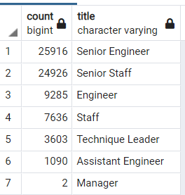
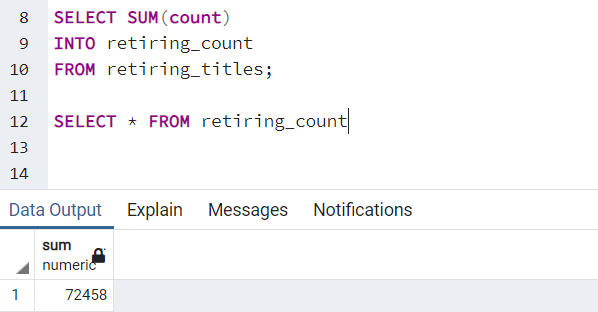
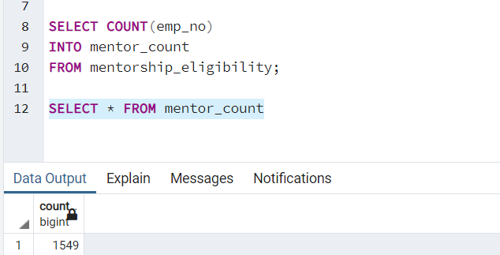

# Pewlett Hackard Analysis

## Overview of Pewlett Hackard Analysis

Using the provided data to find the number of retiring employees per title as well as identifying employees eligible to participate in a mentorship program. 

## Pewlett Hackard Analysis Results

### Results: Provide a bulleted list with four major points from the two analysis deliverables. Use images as support where needed.
- Senior Engineers and Staff show the largest majority of those retiring, with 25,916 and 24,926 respectively (see below), a large number of high-level employees that will need to be replaced.

- Only 2 managerial roles (see above) will need to be filled after retirements make those positions available.
- Over 70,000 employees are retirement eligible. 
- There are 1,549 eligible mentors to help prepare new recruits.

## Pewlett Hackard Analysis Summary

### Summary: Provide high-level responses to the following questions, then provide two additional queries or tables that may provide more insight into the upcoming "silver tsunami."

#### How many roles will need to be filled as the "silver tsunami" begins to make an impact?
- Making a SUM query to find the total number of employees that would be retiring showed a result of 72,458 (see below) roles that will need to be filled. 

#### Are there enough qualified, retirement-ready employees in the departments to mentor the next generation of Pewlett Hackard employees?
- Making a COUNT query to find the total number of retirement-ready employees turned out a result of 1,549 eligible mentors (see below). That number, compared to the number retiring, suggests a gap and mentors may be overwhelmed with the amount of new recruits they will have to assist in filling empty roles.

## Resources
- Data Source: [Pewlett Hackard Data](https://github.com/LnzyDee/Pewlett-Hackard-Analysis/tree/main/Data)
- Software: [Python](https://www.python.org/), 3.7.6, [Visual Studio Code](https://code.visualstudio.com/), 1.65.2, [PostgresSQL](https://www.enterprisedb.com/downloads/postgres-postgresql-downloads)
